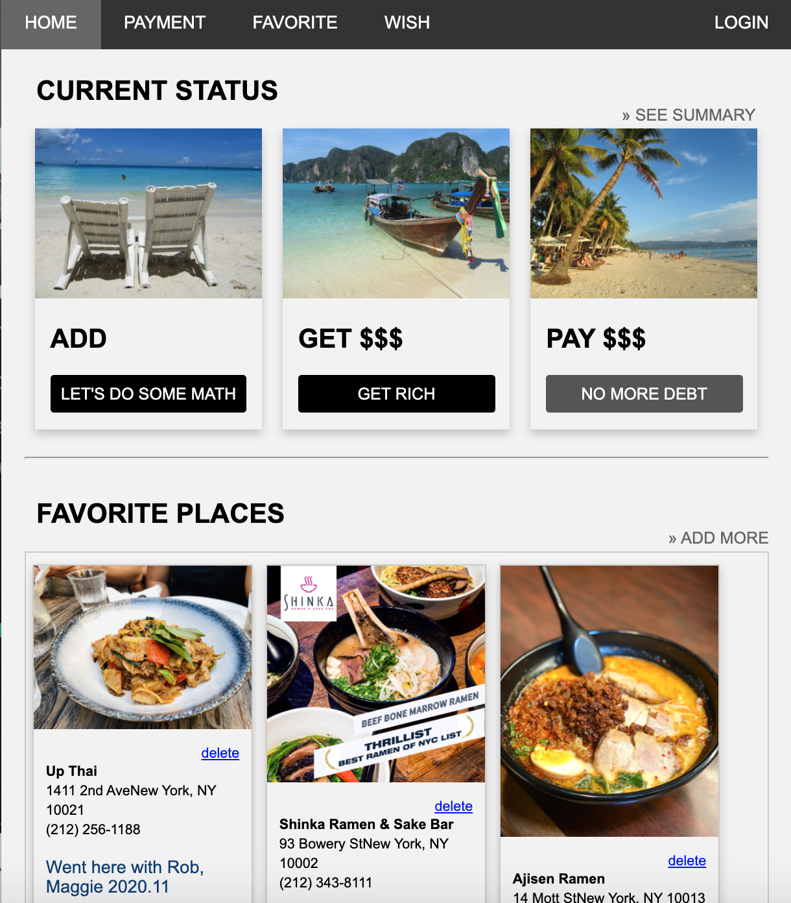
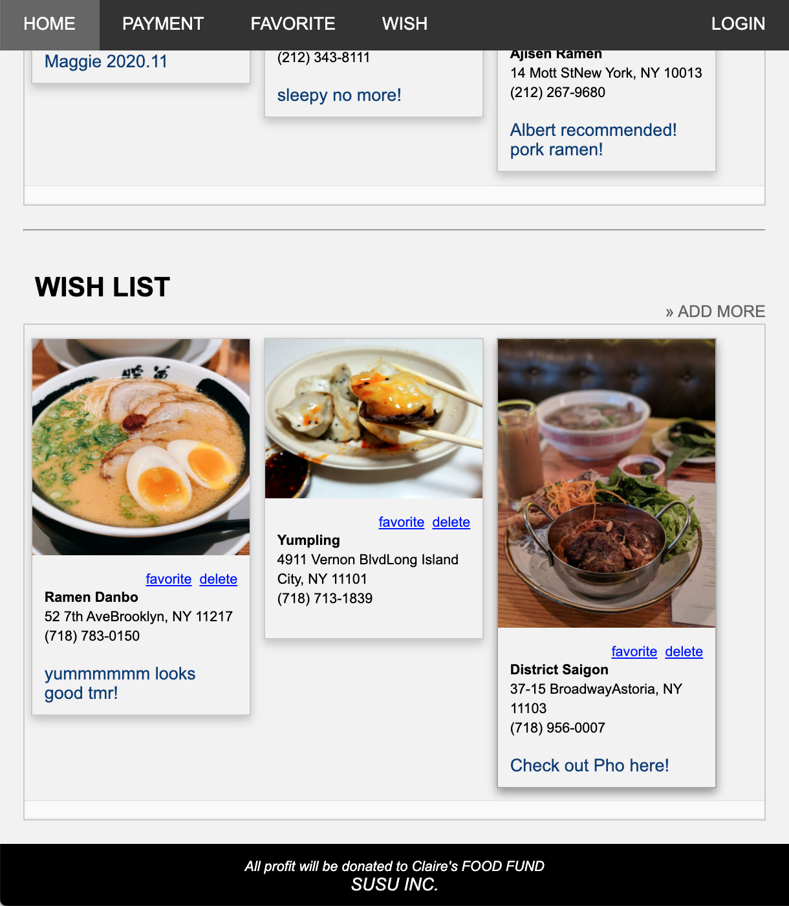

# MVP
Project to build a Minimum Viable Product for 2days

## Overview
Overview MVP product

{width=640}
{width=300} {width=300}
{width=300}
{width=300}
{width=300}
{width=300}
{width=300}

## Technologies
For this project, I used the following languages and frameworks in my implementation:
- Javascript
- react
- axios
- Node.js
- Express
- MongoDB
- Mongoose ODM
- Docker
- Heroku

## Installation
  1. clone this repo to your local machine
  2. run ```npm install``` in the 'root' directory
  2. run ```npm run build-prod```
  3. run ```npm run build-dev```
  4. run ```npm start```
  5. find the site on ***localhost:2000***
